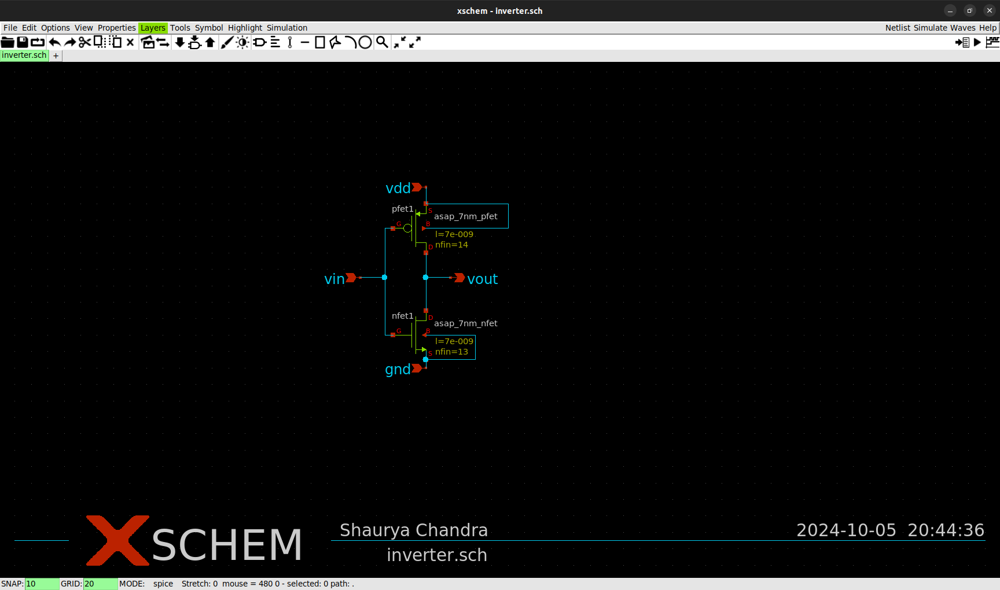

# ASAP7_FinFET_Inverter_Characterization
This repository provides a comprehensive characterization of a 7nm FinFET-based inverter designed using the ASAP7 PDK. The project includes schematic capture with Xschem, layout design using Magic, and simulation using NGSpice. The key deliverables are the DC, AC, and Voltage Transfer Characteristics (VTC) analysis, offering valuable insights into the performance of FinFET-based inverters at advanced technology nodes. This work is intended to serve as a resource for researchers, students, and engineers in the field of VLSI design and nanoelectronics. Contributions and feedback are welcome.

## Tools

<details>
  <summary>1. ASAP7 PDK</summary>

  **Description:**
  The **ASAP7 Process Design Kit (PDK)** is a 7nm predictive PDK developed for academic use. It is based on FinFET technology and provides models, libraries, and design rules for advanced semiconductor design. The PDK is designed to give realistic simulation results for circuits operating in the sub-10nm regime, using predictive technology models.

  **Why Chosen:**
  ASAP7 was selected for this project to accurately model and simulate 7nm FinFET-based designs. As the focus of the project is on next-generation semiconductor technology, ASAP7 provides the necessary tools and libraries to design, simulate, and validate FinFET-based circuits. This PDK helps ensure that the design matches real-world manufacturing conditions, with accurate parasitic, timing, and power estimates.

  **Version** [r1p7](https://github.com/The-OpenROAD-Project/asap7)

</details>

<details>
  <summary>2. BSIM4 CMG FinFET Model</summary>

  **Description:**
  The [**BSIM4 Compact Multi-Gate (CMG) Model**](https://www.bsim.berkeley.edu/models/bsimcmg/) is a widely accepted SPICE model used for FinFET transistors. It offers a framework for simulating devices with multi-gate structures, including double-gate and triple-gate FinFETs, which are the foundation of modern nanometer-scale transistor technology.

  **Why Chosen:**
  The BSIM4 CMG model was chosen due to its compatibility with FinFET technology, particularly the 7nm FinFETs used in this project. It provides a highly accurate representation of the electrical behavior of FinFET devices, including short-channel effects, mobility degradation, and quantum effects. This model is essential for achieving precise simulation results in advanced CMOS designs like the inverter being characterized.

  **Version:** [Standard Release BSIM-CMG 111.2.1 (06/06/2022)](https://www.bsim.berkeley.edu/BSIMCMG/BSIM-CMG_111.2.1_06062022.tar.gz)

</details>

<details>
  <summary>3. OpenVAF</summary>

  **Description:**
  [**OpenVAF (Open Verilog Analog Framework)**](https://openvaf.semimod.de) is a tool used to integrate analog and mixed-signal simulations into a Verilog environment. It allows for both analog and digital simulations to coexist, enabling the simulation of circuits that involve both types of signals, such as inverters and mixed-signal systems.

  **Why Chosen:**
  OpenVAF is used to bridge the gap between analog and digital simulations in this project. Given that the inverter design involves both analog characteristics (e.g., voltage transfer curves) and digital characteristics (e.g., logic levels), OpenVAF facilitates a seamless simulation workflow. It also allows for mixed-mode verification, ensuring the design is fully validated in both analog and digital domains.

  **Usage** OpenVAF is used to generate the BSIM_OSDI Image compatible with NGSpice Simulation from the downloaded BSIM CMG Models

  The `bsimosdi.osdi` file plays a crucial role when working with **OpenVAF** and **BSIM4 CMG** models in **NGSpice simulations**. 

#### What is `bsimosdi.osdi`?

`bsimosdi.osdi` is a data file generated by **OpenVAF** that serves as an **Optimized Simulator Sata Interface** (OSDI) for BSIM models, specifically **BSIM4 CMG FinFET models**. This file encapsulates the device model information in a format that is highly efficient for NGSpice simulations, reducing the computational load required to handle complex FinFET device physics.

---

#### Workflow for Generating and Using `bsimosdi.osdi`:

1. **Download the BSIM CMG Model Files:**
   - These are provided by various sources (like Berkeley) for FinFET devices.

2. **Generate the `bsimosdi.osdi` File Using OpenVAF:**
   - OpenVAF processes the **BSIM4 CMG** model files and converts them into the `bsimosdi.osdi` format, which is optimized for NGSpice.
   - During this process, the model parameters are encoded into a format that NGSpice can directly interpret.

3. **Include the `bsimosdi.osdi` in NGSpice Simulations:**
   - In your NGSpice simulation script (SPICE netlist), the `bsimosdi.osdi` file is referenced to load the pre-compiled BSIM model data.
   - Symbol files are created using ASAP7 PDK Data for parameter values of BSIM CMG Model.
   - These symbol files contain the reference for the generated `bsimosdi.osdi`
ary file.
   - Example: In the [7nm NFET Symbol file](Xschem_ASAP7/asap_7nm_nfet.sym)
   ```SPICE
    .control
    pre_osdi <path_to_generated_bsimosdi.osdi>
    .endc
   ```
   - NGSpice uses this osdi file to simulate the behavior of the FinFET devices in your circuit without needing to recalculate model parameters from scratch.

---

</details>

<details>
  <summary>4. Xschem</summary>

  **Description:**
  [**Xschem**](https://xschem.sourceforge.io/stefan/index.html) is a graphical schematic editor used to design and capture analog, digital, and mixed-mode circuits. It supports hierarchical design, and its integration with **NGSpice** makes it a powerful tool for simulation and analysis. It’s particularly useful for creating circuit schematics and generating the necessary SPICE netlists for simulation.

  **Why Chosen:**
  Xschem was chosen due to its user-friendly interface and seamless integration with NGSpice. For this project, where FinFET-based circuits like NFETs and inverters are being simulated, Xschem simplifies the design process and provides a quick way to visualize circuit schematics. Its support for hierarchical designs also helps in managing complex designs efficiently.

</details>

<details>
  <summary>5. NGSpice</summary>

  **Description:**
  **NGSpice** is an open-source mixed-level/mixed-signal electronic circuit simulator. It’s used for simulating circuits at the transistor level, offering SPICE-like capabilities. NGSpice is widely used in academic and professional settings to perform various types of simulations, including DC, AC, transient, and noise analysis.

  **Why Chosen:**
  NGSpice was selected because of its powerful simulation capabilities, particularly for the DC and AC characterization of circuits in this project. It is essential for generating the voltage transfer characteristics (VTC) of the inverter design, and its compatibility with both Xschem and the BSIM4 CMG FinFET model makes it the ideal simulation tool for this FinFET-based project.

  For further information, refer the [Ngspice Manual](https://ngspice.sourceforge.io/docs/ngspice-manual.pdf)

</details>


## Types of Simulations
<details>
  <summary><strong> Types of Simulations </strong></summary>

1. **DC Simulation:** This is time-independent and is used to analyze circuits without considering time-varying elements like capacitors or inductors. Capacitors are treated as open circuits, and inductors as short circuits. This is useful for determining how circuits respond to fixed voltage or current sources.
2. **Transient Simulation:** Time-dependent simulation, which models the behavior of circuits over time. It's more complex than DC simulations and requires initial conditions (often obtained from a preceding DC simulation) for capacitors and inductors.
3. **AC Simulation:** Involves frequency-dependent analysis. It’s typically used for analog circuits like amplifiers, where you need to know the frequency range in which the amplifier works effectively.

</details>

## Pre-Layout Simulations
### NFET 

<details>
  <summary><strong> 1. Schematic Design </strong></summary>

#### 1. Schematic Design
   - The schematic design for the **NFET** was created in **Xschem** using the **ASAP7 7nm FinFET library**. The NFET is characterized with a gate voltage (Vgs) and drain voltage (Vds) to observe its electrical behavior.
   - The NFET device has the following properties:
     - **Length (l):** 7nm
     - **Number of fins (nfin):** 14
   - Voltage sources **Vgs** and **Vds** are applied, and the output characteristics are plotted.

   **NFET Schematic:**
   
</details>

<details>
  <summary><strong> 2. Simulation Setup </strong></summary>
  
#### 2. Simulation Setup
   - The **NGSpice** simulation runs a **DC sweep** for both **Vds** and **Vgs** to analyze the NFET behavior.
   - The DC sweep is configured as:
     ```spice
     .dc Vds 0 0.7 1m Vgs 0 0.7 0.2
     ```
   - The simulation outputs the **drain current (Id)** as a function of the applied **Vds** and **Vgs**, providing insight into the transistor's switching behavior and current flow characteristics.

   **Simulation Parameters:**
   - **Vds Sweep Range:** 0V to 0.7V
   - **Vgs Sweep Range:** 0V to 0.7V with a step of 0.2V
</details>

<details>
  <summary><strong> 3. Simulation Results </strong></summary>
  

#### 3. Simulation Results:
   - The results include the **Id vs Vds** curve for different values of **Vgs**, showing how the drain current changes with increasing drain-source voltage for various gate-source voltages.
   - This helps in understanding the linear and saturation regions of the NFET's operation.

   **NFET Simulation Output (Id vs Vds):**
   

</details>

---

### Inverter Pre Layout Sim & Characterisation
<details>
  <summary><strong> 1. Schematic Design </strong></summary>

#### 1. Schematic Design
   - The pre-layout schematic design of the inverter is created using **Xschem**. The design consists of a basic CMOS inverter with a PFET and NFET transistor, where the PFET is connected to VDD and the NFET to GND.
   - The input signal, **Vin**, is applied to the gate terminals of both transistors, while the output signal, **Vout**, is observed at the shared drain of the PFET and NFET.

   **Inverter Testbench:**
   

</details>

<details>
  <summary><strong> 2. Symbol Creation </strong></summary>

#### 2. Symbol Creation  
  **Inverter Symbol:**
  


</details>

<details>
  <summary><strong> 3. Inverter Testbench </strong></summary>

#### 3. Inverter Testbench:
**Inverter Testbench:**
   

This Xschem schematic defines a setup for simulating an inverter circuit using FinFETs with varying transistor fin sizes. It includes sources for power and input, ground connections, and measurements for important metrics like delay, gain, noise margins, power consumption, and switching frequency. Here's a breakdown:

<details>
    <summary><strong> Testbench Components </strong></summary>

##### Testbench Components

1. **Inverter Design**: The inverter (`inverter.sym`) is placed in the circuit with connections to VDD, VIN, and VOUT.
2. **Voltage Sources**:
   - VDD is set to 0.7V.
   - VIN is a pulse signal defined as `"PULSE(0 0.7 0p 10p 10p 20p 60p 2)"`, representing a periodic input for the inverter.
3. **Ground Connections**: Three GND components connect to different parts of the circuit.
4. **Pins**: The schematic has labeled pins (e.g., VDD, VIN, VOUT) for signal clarity.
5. **Script Component** (`code_shown.sym`): This section defines a control script in `.control` blocks that automates simulations, sweeping through different fin sizes for the nFET and pFET transistors (from 2 to 14 fins).

    - The simulation is carried out using **NGSpice** to observe the inverter's voltage transfer characteristics (VTC). The **Vin** is swept from 0 to VDD, and **Vout** is measured at different points to capture the inverter's response.
    - It performs a **DC analysis** to find the voltage at which VIN equals VOUT (Vm), as well as measures metrics like gain, output resistance, and noise margins (NMH and NML).
    - It also conducts **transient analysis** to measure timing metrics like rise and fall times, propagation delay, and switching frequency.
    - Power consumption is calculated based on current through the VDD source.


The results are saved to a CSV file (`results.csv`) with fields for WpFET, WnFET, Vm, Id, gain, NMH, NML, Gm, propagation delay (tpd), rise time (tRise), fall time (tFall), switching frequency (Fsw), power, and output resistance (Rout).

</details> 

<details>
  <summary><strong> Spice Deck Components </strong></summary>

##### Spice Deck Components

This section explains how the `.control` block inside the schematic automates the simulation process and captures the key performance metrics of the FinFET-based inverter across different transistor fin configurations.

---

<details>
  <summary><strong> 1. Simulation Setup </strong></summary>

###### 1. **Simulation Setup (`.control` block)**

This block initializes the simulation environment and sets the file type and output formats.

- `run`: Starts the simulation process.
- `set filetype=ascii`: Specifies that results will be written in ASCII format.
- `set appendwrite`: Ensures that data is appended to the CSV file without overwriting it.
</details>


<details>
  <summary><strong> 2. Result File Setup </strong></summary>

###### 2. **Result File Setup**

- `echo \\"WPfet,WNfet,Vm,Id,Gain,NMH,NML,Gm,tpd,tRise,tFall,Fsw,Power,Rout\\" > results.csv`: Creates a header row in `results.csv` to store key metrics for each simulation iteration.
</details>

<details>
  <summary><strong> 3. Transistor Fin Sweep </strong></summary>

###### 3. **Transistor Fin Sweep**

The nested loops adjust the number of fins for the nFET and pFET transistors, allowing performance analysis over a range of fin configurations.

- `foreach wpfet 14 13 12 ... 2`: Loops through the values of `wpfet` (fin size for pFET) from 14 to 2.
- `foreach wnfet 14 13 12 ... 2`: Loops through the values of `wnfet` (fin size for nFET) from 14 to 2.
- `alter n.x1.xpfet1.npmos_finfet nfin = $wpfet`: Modifies the number of fins for the pFET in the inverter.
- `alter n.x1.xnfet1.nnmos_finfet nfin = $wnfet`: Modifies the number of fins for the nFET in the inverter.
- `show n.x1.xpfet1.npmos_finfet : nfin` and `show n.x1.xnfet1.nnmos_finfet : nfin`: Displays the fin count for each transistor for verification.
</details>

<details>
  <summary><strong> 4. DC Analysis </strong></summary>

###### 4. **DC Analysis**

- `dc vin 0 0.7 1m`: Performs a DC sweep of the input voltage (`vin`) from 0 to 0.7V, with a step size of 1mV.
- `meas dc vm when vin=vout`: Captures the **Threshold Voltage (Vm)** where `vin` equals `vout`.

Conditions: 
- The midpoint voltage (`vm`) is checked to ensure it lies between 0.34V and 0.36V. Only if this condition is satisfied, the transient analysis and metric calculations are performed.
</details>

<details>
  <summary><strong> 5. DC Characteristics </strong></summary>

###### 5. **DC Characteristics**

Upon satisfying the voltage conditions, the script calculates the following VTC:

- **Gain**: 
  - `let gm = real(deriv(id, vin))`: Computes the transconductance (`gm`), which is the derivative of current (`id`) with respect to `vin`.
  - `meas dc gm_max MAX gm`: Records the maximum gain value during the sweep.
  
- **Output Resistance**:
  - `let rout = abs(real(deriv(vout, id)))`: Measures the output resistance.
  - `meas dc rout_max MAX rout`: Captures the maximum output resistance.

- **Current**:
  - `let id = abs(vdd#branch)`: Measures the absolute current through the VDD source.
  - `meas dc id_max MAX id`: Stores the maximum current value.

- **Noise Margins**:
  - `meas dc vil find vin when gain_scaled=0.7 cross=1`: Measures the **low noise margin (NML)** by finding the input voltage when the gain reaches 0.7 during the first crossing.
  - `meas dc vih find vin when gain_scaled=0.7 cross=last`: Measures the **high noise margin (NMH)** during the last crossing.
  - `let vol = 0` and `let voh = 0.7`: Sets the logic high (`voh`) and logic low (`vol`) values to compute NMH and NML.

</details>

<details>
  <summary><strong> 6. Transient Analysis </strong></summary>

###### 6. **Transient Analysis**

- `tran 0.02p 125p`: Runs a transient analysis for 125 picoseconds with a time step of 0.02 picoseconds.

**Simulation Output | PFET_nfin = 14, NFET_nfin = 13 and Vth = 0.349V**


Timing metrics:

> **Note:** The first transition may include noise or an unstable response due to initialization effects or transient settling. To avoid inaccuracies caused by initial conditions, it is common to ignore the first transition and use RISE=2 (or FALL=2), which measures the second complete transition when the circuit has settled into its periodic behavior.


- **Propagation Delay**:
  - `meas tran tin_rise50 when vin=0.35 RISE=2`: Captures the input rise time at 50% of VIN.
  - `meas tran tout_fall50 when vout=0.35 FALL=2`: Captures the output fall time at 50% of VOUT.
  - `meas tran tin_fall50 when vin=0.35 FALL=2`: Measures the input fall time at 50% of VIN.
  - `meas tran tout_rise50 when vout=0.35 RISE=2`: Measures the output rise time at 50% of VOUT.
  - `let tpd = (tpHL+tpLH)/2`: Computes the average **propagation delay (tpd)** from high-to-low and low-to-high transitions.


- **Rise/Fall Time**:
  - `meas tran tout_rise90 when vout=0.63 RISE=2`: Captures the 90% rise time of the output.
  - `meas tran tout_fall10 when vout=0.07 FALL=2`: Captures the 10% fall time of the output.
  - `let tr = tout_rise90 - tout_rise10`: Computes the total **rise time**.
  - `let tf = tout_fall10 - tout_fall90`: Computes the total **fall time**.

- **Switching Frequency**:
  - `let fsw = 1/(tr+tf)`: Calculates the **switching frequency (Fsw)** based on rise and fall times.

- **Power Consumption**:
  - `meas tran id_integ integ id_tran from=60e-12 to=120e-12`: Integrates the current over a period of time to estimate power.
  - `let power_int = id_integ*0.7`: Multiplies the integrated current by the supply voltage (0.7V) to compute power.
  - `let power = abs(power_int/60)`: Calculates the average **power consumption**.

</details>

<details>
  <summary><strong> 7. Result Output </strong></summary>

###### 7. **Result Output**

- `echo \\"$wpfet,$wnfet,$&dc.vm,$&dc.id_max,$&dc.gain_max,$&dc.nmh,$&dc.nml,$&dc.gm_max,$&tran.tpd,$&tran.tr,$&tran.tf,$&tran.fsw,$&tran.power,$&dc.rout_max\\" >> results.csv`: Appends the calculated metrics for each co.osdiation of nFET and pFET fins to the CSV file.
</details>

<details>
  <summary><strong> 8. End of Control Block </strong></summary>

###### 8. **End of Control Block**

- `.endc` signals the end of the control block.
- `.save all`: Saves all signals and simulation data.
- `.end`: Marks the conclusion of the script.
</details>

</details>

</details>


<details>
  <summary><strong> 4. Simulation Results </strong></summary>


#### 4. Simulation Parameters for 7nm FinFET Inverter (ASAP7 PDK, BSIM4 CMG FinFET Model)

The [Inverter_Pre_Layout_Sim_Results CSV file](sim_results/inverter_pre_layout_sim_results.csv) in the `sim_results` folder contains the key simulation parameters of a 7nm FinFET Inverter using the ASAP7 Process Design Kit (PDK), based on the BSIM4 CMG FinFET Model. The parameters captured during the inverter characterization include device dimensions, voltage metrics, timing, and power details.

##### CSV Columns:

- **WPfet**: Width of the PFET (in number of fins).
- **WNfet**: Width of the NFET (in number of fins).
- **Vm**: Inverter switching threshold voltage (V).
- **Id**: Drain current (A).
- **Gain**: Voltage gain of the inverter.
- **NMH**: Noise Margin High (V).
- **NML**: Noise Margin Low (V).
- **Gm**: Transconductance (S).
- **tpd**: Propagation delay (s).
- **tRise**: Rise time (s).
- **tFall**: Fall time (s).
- **Fsw**: Switching frequency (Hz).
- **Power**: Power consumption (W).
- **Rout**: Output resistance (Ω).

##### Preview Data:
| WPfet | WNfet | Vm       | Id       | Gain   | NMH  | NML  | Gm       | tpd        | tRise      | tFall      | Fsw        | Power      | Rout    |
|-------|-------|----------|----------|--------|------|------|----------|------------|------------|------------|------------|------------|---------|
| 14    | 14    | 0.344786 | 0.000226 | 6.4284 | 0.252  | 0.246| 0.036184 | 6.93e-13   | 2.98e-12   | 2.79e-12   | 1.73e+11   | 1.98e-17   | 15.8751 |
| 14    | 13    | 0.349913 | 0.000217 | 6.4273 | 0.266| 0.254| 0.033637 | 6.94e-13   | 2.98e-12   | 2.80e-12   | 1.73e+11   | 1.90e-17   | 1500.15 |
| 14    | 12    | 0.355439 | 0.000208 | 6.4308 | 0.258| 0.262| 0.031090 | 6.95e-13   | 2.98e-12   | 2.80e-12   | 1.72e+11   | 1.83e-17   | 13.5661 |

---

</details>


## Magic Layout

<!-- <details>
  <summary><strong>## Overview</strong></summary>

  <p>This is a <em>collapsible section</em> where you can find information.</p>
  
  <h3>Key Features:</h3>
  <ul>
    <li><b>Feature 1:</b> Description of feature 1.</li>
    <li><b>Feature 2:</b> Description of feature 2.</li>
  </ul>

  <p>For more details, visit <a href="https://example.com">our website</a>.</p>
</details> -->
